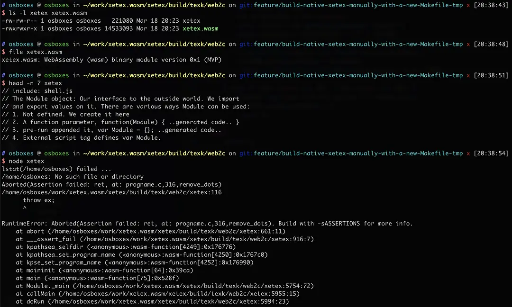

## XeTeX.wasm

This project is still **WIP**.

This project tries to compile [XeTeX](https://xetex.sourceforge.net/) to
WebAssembly to make it available on the web.

Preview:



Design goals:

- [ ] compile XeTeX to WebAssembly
- [ ] dynamically load packages, fonts and other necessary assets when compiling
      tex files
- [ ] support modern JavaScript modules
- [ ] [optional] support Node.js

### How to build

Check [Build.md](./Build.md) and [Makefile](./Makefile) for details.

### Init xetex repo as a subtree

```sh
git remote add -f xetex https://github.com/TeX-Live/xetex
git subtree add --prefix xetex xetex 8af2b58c82bdfcd2791a31b506c602d6b9abdf1c
```

A tutorial for git subtree can be found
[here](https://www.atlassian.com/git/tutorials/git-subtree)
